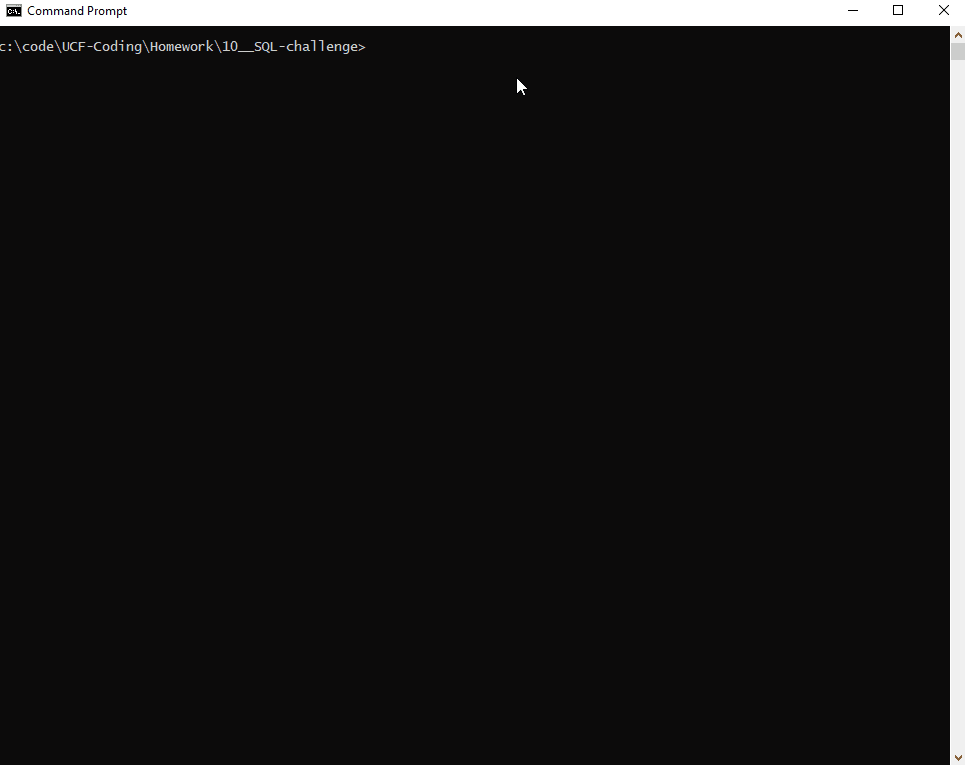

  # mysql-challenge
  

## Description
In this repository, I created a Content Management System (CMS) command-line interface (CLI) to manage employees of a company.  You can add departments, roles, and employees, as well as view your employees by manager, department or view a combined buget of a department.

## Table of Contents
- [mysql-challenge](#mysql-challenge)
  - [Description](#description)
  - [Table of Contents](#table-of-contents)
  - [Installation](#installation)
  - [Usage](#usage)
    - [Option 1](#option-1)
    - [Option 2](#option-2)
  - [License](#license)
  - [Contributing](#contributing)
  - [Questions](#questions)

## Installation
Start by executing <code>npm run install</code> in the terminal.

## Usage
### Option 1
To create and seed the database as well as run, execute 
1. <code>npm run all</code> into the terminal.  
<caption>You will be prompted for your mysql password for the root user twice.  Once for the schema.sql file and once for the seed.sql file.</caption>  

### Option 2
Alternatively, you can run 

1. <code>npm run migrate</code> 
2. <code>npm run seed</code> 
3. <code>npm run start</code> 
<caption>to run each command in succession to start the node application.</caption>

## License

  
A short and simple permissive license with conditions only requiring preservation of copyright and license notices. Licensed works, modifications, and larger works may be distributed under different terms and without source code.

## Contributing
Feel free to contribute!

## Questions
Visit my [Github](http://www.github.com/kpessa) at github.com/kpessa